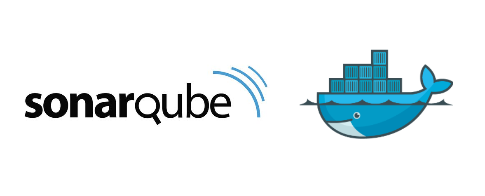

## Talk is Cheap, Show Me the Code
Como exemplo, podemos executar o comando abaixo para que a stack suba.
```./run.sh ```

Para analisar os codigos que estão na pasta *samples*, execute o comando abaixo.
```./analise.sh ```

Após a execução, entre no dashboard e verifique os resultados.

```http://localhosts:9000 - User=admin - Pass=admin  ```